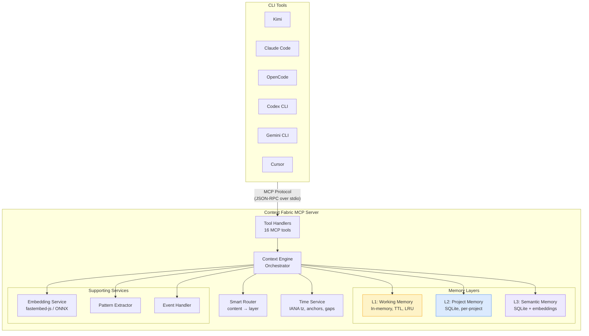
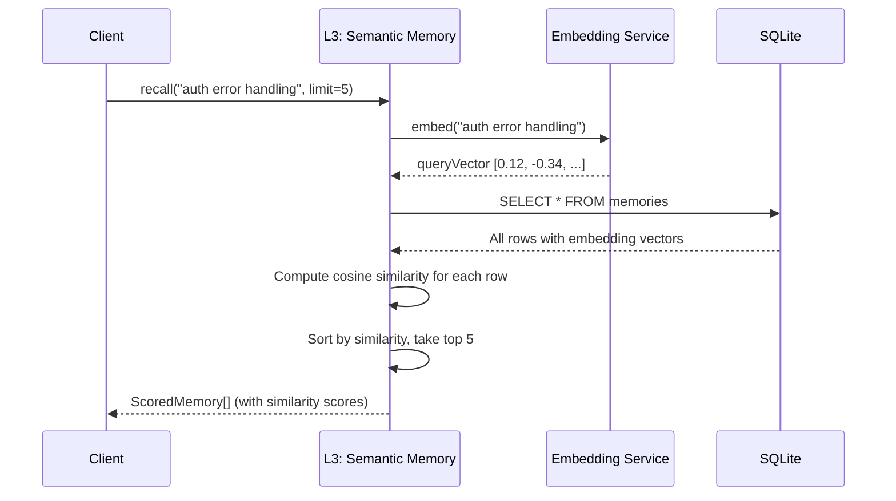
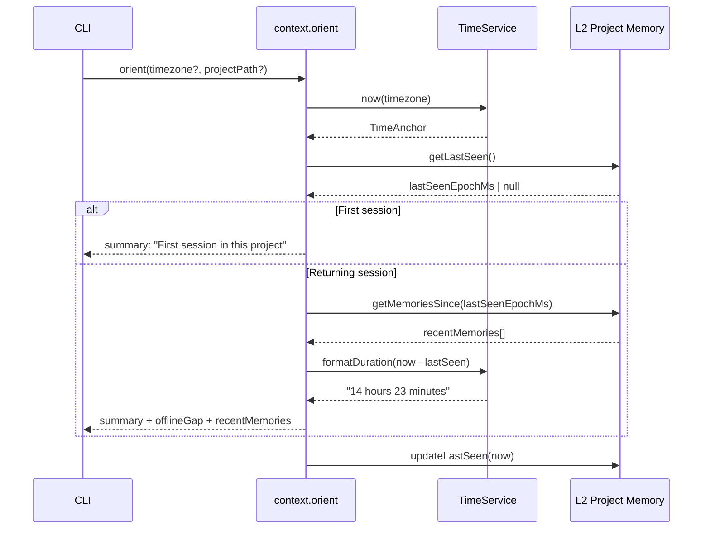
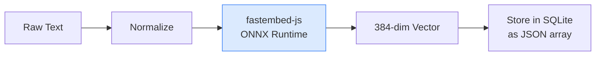
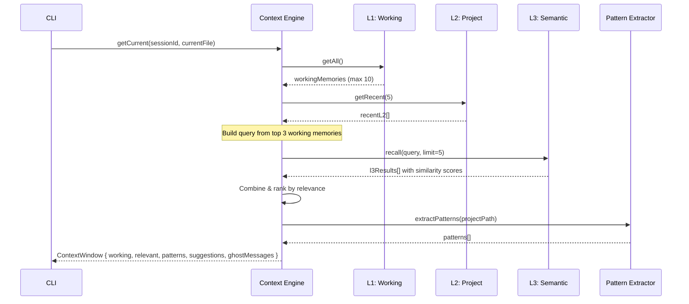
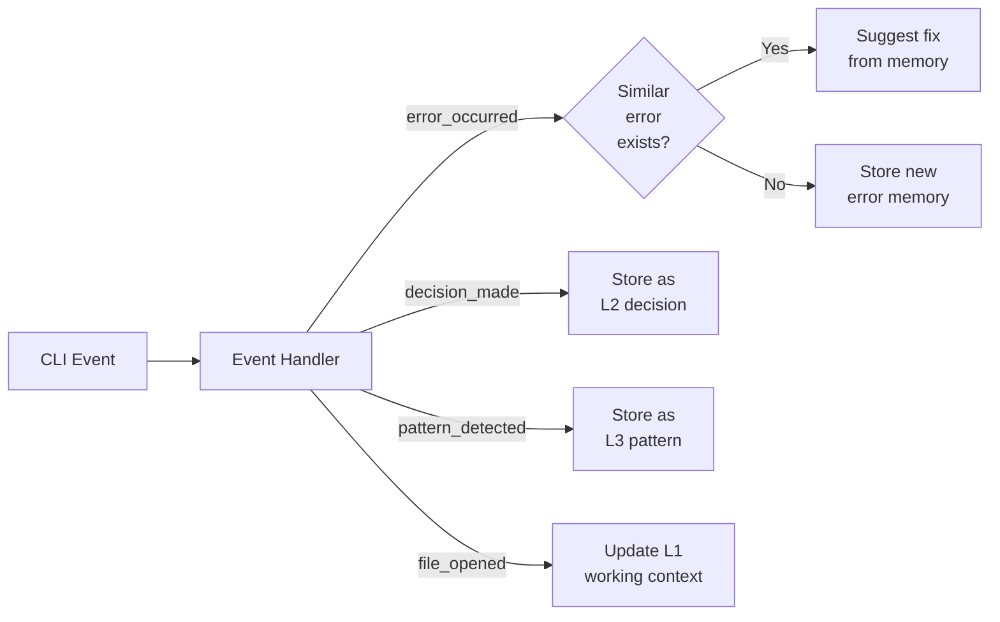
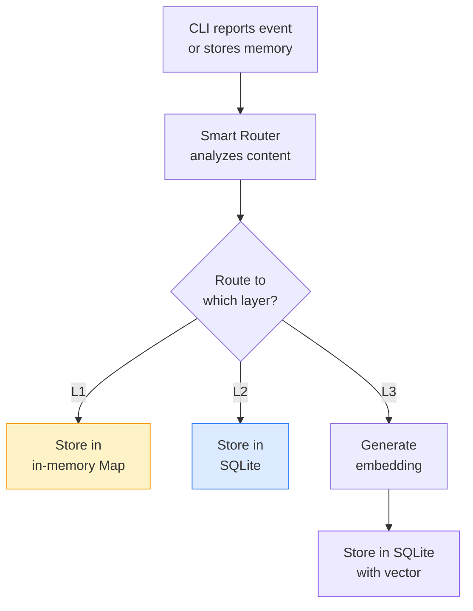
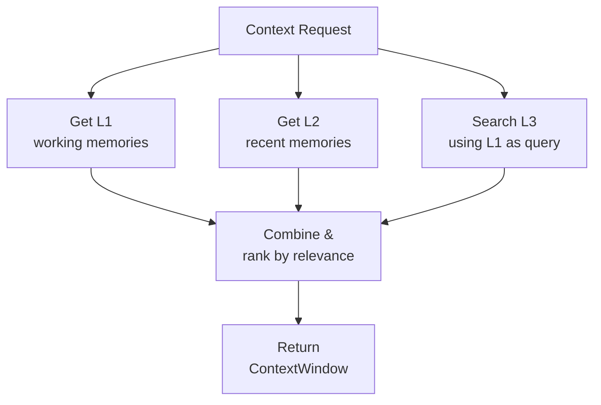

# Architecture

How Context Fabric works under the hood. Read this if you want to contribute, extend the system, or understand the design trade-offs.

## Table of Contents

- [System Overview](#system-overview)
- [The Three Layers](#the-three-layers)
  - [L1: Working Memory](#l1-working-memory)
  - [L2: Project Memory](#l2-project-memory)
  - [L3: Semantic Memory](#l3-semantic-memory)
- [Time Service](#time-service)
- [Routing Logic](#routing-logic)
- [Embedding Strategy](#embedding-strategy)
- [Decay Algorithm](#decay-algorithm)
- [Context Window Construction](#context-window-construction)
- [Event Handling](#event-handling)
- [Data Flow](#data-flow)
- [Performance](#performance)

## System Overview

Context Fabric is an MCP server that communicates with CLI tools over stdio using the JSON-RPC protocol. The server can run locally via Node.js or inside a Docker container.



### Key Design Decisions

- **Zero external services**: All storage is SQLite (`node:sqlite` built-in), all vector search is in-process. No external databases, no API keys.
- **Node.js 22.5+**: Required for the built-in `node:sqlite` module, which provides synchronous SQLite access with zero native dependencies.
- **Stdio transport**: MCP tools communicate over stdin/stdout using JSON-RPC. This works identically whether the server runs as a local process or inside Docker.
- **Per-project engines**: Each unique `projectPath` gets its own `ContextEngine` instance with isolated L2 state. L3 is shared globally.

## The Three Layers

### L1: Working Memory

Ephemeral session-scoped context stored in an in-memory `Map`.

```typescript
class WorkingMemoryLayer {
  private memories: Map<string, WorkingMemoryEntry>;
  private maxSize: number = 1000;
  private defaultTTL: number = 3600; // 1 hour

  store(content, type, metadata, ttl?): Memory
  get(id): Memory | undefined
  getAll(): Memory[]
  cleanup(): number // removes expired entries
}
```

- **TTL-based**: Each entry has an expiration timestamp. Expired entries are cleaned up periodically.
- **LRU eviction**: When `maxSize` is reached, the least-recently-used entry is evicted.
- **No persistence**: All data is lost on server restart. This is by design — L1 is for scratch data.

### L2: Project Memory

Persistent project-specific knowledge stored in SQLite.

```typescript
class ProjectMemoryLayer {
  private db: DatabaseSync;       // from node:sqlite
  private projectPath: string;

  store(content, type, metadata, tags?): Memory
  get(id): Memory | undefined
  search(query): Memory[]
  summarize(olderThanDays): SummaryResult
  getLastSeen(): number | null
  updateLastSeen(): void
  getMemoriesSince(epochMs): Memory[]
}
```

**Schema:**

```sql
CREATE TABLE memories (
  id TEXT PRIMARY KEY,
  type TEXT NOT NULL,
  content TEXT NOT NULL,
  metadata TEXT,          -- JSON blob
  tags TEXT,              -- JSON array
  created_at INTEGER NOT NULL,
  updated_at INTEGER NOT NULL,
  access_count INTEGER DEFAULT 0,
  last_accessed_at INTEGER
);

CREATE TABLE project_meta (
  key TEXT PRIMARY KEY,
  value TEXT NOT NULL
);

CREATE INDEX idx_type ON memories(type);
CREATE INDEX idx_created ON memories(created_at);
```

The `project_meta` table stores per-project metadata. The `last_seen` key is used by `context.orient` to detect offline gaps between sessions.

### L3: Semantic Memory

Long-term cross-project knowledge with vector search.

```typescript
class SemanticMemoryLayer {
  private db: DatabaseSync;       // from node:sqlite
  private embedder: EmbeddingService;
  private decayDays: number = 30;

  store(content, type, metadata): Memory
  recall(query, limit): ScoredMemory[]
  applyDecay(): number  // returns count of deleted memories
}
```

**Vector search flow:**



Embedding vectors are stored as JSON arrays in a `TEXT` column. Cosine similarity is computed in-process — a full linear scan over all rows. This is fast for typical memory counts (under 10K entries).

## Time Service

The `TimeService` (`src/time.ts`) provides timezone-aware time utilities using only the built-in `Intl` API. No external date libraries.

### Capabilities

| Method | Description |
|--------|-------------|
| `now(tz?)` | Full `TimeAnchor` with UTC offset, day/week boundaries, ISO week number |
| `atTime(epochMs, tz?)` | Build a `TimeAnchor` for an arbitrary moment |
| `resolve(expression, tz?)` | Natural-language date resolver |
| `convert(epochMs, tz)` | World-clock conversion to any IANA timezone |
| `formatDuration(ms)` | Human-readable duration (`"3 hours 42 minutes"`) |
| `formatRelative(epochMs)` | Relative time (`"5 minutes ago"`, `"in 2 hours"`) |

### TimeAnchor Structure

A `TimeAnchor` is a rich time snapshot containing everything an AI needs to reason about time:

```typescript
interface TimeAnchor {
  epochMs: number;          // Unix timestamp
  iso: string;              // "2026-02-25T14:30:00.000-05:00"
  timezone: string;         // "America/New_York"
  utcOffset: string;        // "-05:00"
  timeOfDay: string;        // "2:30 PM"
  date: string;             // "Wednesday, February 25, 2026"
  dateShort: string;        // "Feb 25"
  dayOfWeek: string;        // "Wednesday"
  isWeekend: boolean;
  weekNumber: number;       // ISO week number
  // Day and week boundaries (epoch ms)
  startOfDay: number;
  endOfDay: number;
  startOfNextDay: number;
  startOfYesterday: number;
  startOfWeek: number;      // Monday
  endOfWeek: number;        // End of Sunday
  startOfNextWeek: number;
}
```

### Orientation Flow

The `context.orient` tool combines the Time Service with L2's `project_meta` table to detect offline gaps:



## Routing Logic

The Smart Router analyzes content type, tags, and TTL to determine the optimal storage layer. See [Memory Types > Smart Router](memory-types.md#smart-router) for the full decision matrix and flowchart.

### Decision Priority

1. **Explicit layer**: If `layer` is specified, use it directly
2. **Tag-based routing**: `temp` → L1, `global` → L3, `project` → L2
3. **TTL-based routing**: If TTL is set, route to L1
4. **Content type routing**: Each type has a default layer mapping
5. **Default fallback**: Route to L2

## Embedding Strategy

Context Fabric uses fastembed-js for generating embeddings. All vector operations run in-process.

### Model

| Property | Value |
|----------|-------|
| **Model** | `Xenova/all-MiniLM-L6-v2` |
| **Dimensions** | 384 |
| **Size** | ~80MB (ONNX) |
| **Speed** | ~1000 docs/sec on CPU |
| **Runtime** | ONNX — works on any platform |

**Why this model?**
1. Small enough for local execution
2. Good performance on code snippets
3. No API key required
4. Fast embedding generation
5. ONNX runtime runs on any platform

### Embedding Process



```typescript
class EmbeddingService {
  private model: FlagEmbedding;

  async embed(text: string): Promise<number[]> {
    const normalized = this.normalize(text);
    const embedding = await this.model.embed(normalized);
    return Array.from(embedding);
  }
}
```

### Similarity Calculation

Cosine similarity is computed in-process:

```typescript
function cosineSimilarity(a: number[], b: number[]): number {
  let dotProduct = 0, normA = 0, normB = 0;
  for (let i = 0; i < a.length; i++) {
    dotProduct += a[i] * b[i];
    normA += a[i] * a[i];
    normB += b[i] * b[i];
  }
  return dotProduct / (Math.sqrt(normA) * Math.sqrt(normB));
}
// Typical threshold: 0.7
```

## Decay Algorithm

L3 memories use decay instead of TTL. See [Memory Types > Decay Algorithm](memory-types.md#decay-algorithm) for the full formula and lifecycle diagram.

### Summary

```text
score = (age_decay * 0.3 + inactivity_penalty * 0.7) + access_boost
```

- `age_decay = exp(-age / (decayDays * 2))` — older memories fade
- `inactivity_penalty = exp(-timeSinceAccess / decayDays)` — unused memories fade faster
- `access_boost = min(accessCount / 10, 0.5)` — frequent access resists decay
- If `score < 0.1`: memory is **deleted**
- Decay runs automatically every hour

## Context Window Construction

The Context Engine builds a context window by combining memories from all three layers. This is what `context.getCurrent` returns.



The construction algorithm:

1. **L1**: Get all working memories (capped at `maxWorkingMemories`)
2. **L2**: Get the 5 most recent project memories
3. **L3**: Use the top 3 working memory contents as a semantic search query, retrieve top 5 results
4. **Combine**: Merge L2 and L3 results, sort by relevance score, cap at `maxRelevantMemories`
5. **Patterns**: Extract code patterns for the current project
6. **Package**: Return the complete `ContextWindow`

## Event Handling

The Event Handler processes CLI events and automatically captures memories.

### Supported Event Types

| Event Type | Description | Auto-Captured As |
|------------|-------------|-----------------|
| `file_opened` | User opened a file | L1 scratchpad |
| `command_executed` | A command was executed | L1 scratchpad |
| `error_occurred` | An error was encountered | L2 bug_fix (if novel) |
| `decision_made` | An architectural decision | L2 decision |
| `session_start` | New session began | Internal tracking |
| `session_end` | Session ended | Internal tracking |
| `pattern_detected` | Code pattern found | L3 code_pattern |
| `user_feedback` | User gave explicit feedback | Varies by content |



## Data Flow

### Storage Flow



### Retrieval Flow



## Performance

### Memory Usage

| Layer | Per Memory | Max Size |
|-------|-----------|----------|
| L1 | ~1 KB | 1000 entries (~1 MB) |
| L2 | ~2 KB | Unlimited (disk) |
| L3 | ~5 KB (with embedding) | Unlimited (disk) |

### Query Performance

| Operation | L1 | L2 | L3 |
|-----------|:--:|:--:|:--:|
| Store | O(1) | O(1) | O(1)* |
| Get by ID | O(1) | O(1) | O(1) |
| Search | O(n) | O(n) | O(n)** |

\* L3 store requires embedding generation (~50ms per memory)

\*\* In-process cosine similarity scan; fast for typical memory counts (<10K)

### Bottlenecks

- **Embedding generation**: ~50ms per text on CPU. Batched embedding (`batchSize: 32`) helps for bulk operations.
- **L3 recall**: Linear scan over all L3 memories. At 10K memories with 384-dim vectors, this takes <100ms.
- **Cold start**: First embedding requires loading the ONNX model (~2 seconds). Docker pre-bakes the model to avoid download time.

---

[← Agent Integration](agent-integration.md) | [Configuration](configuration.md) | [Back to README](../README.md)
