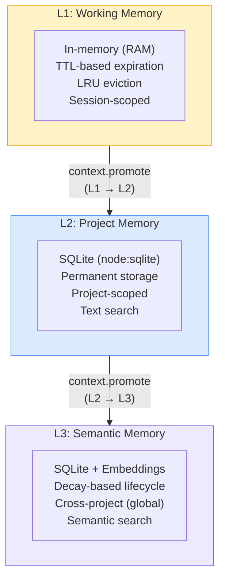
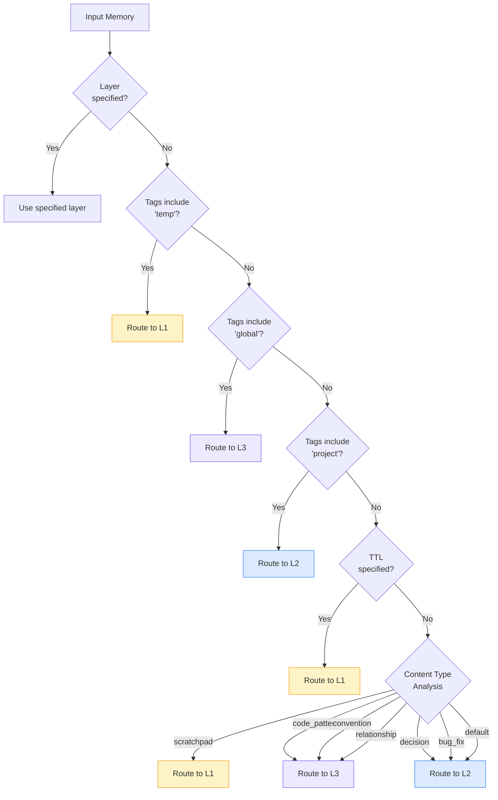
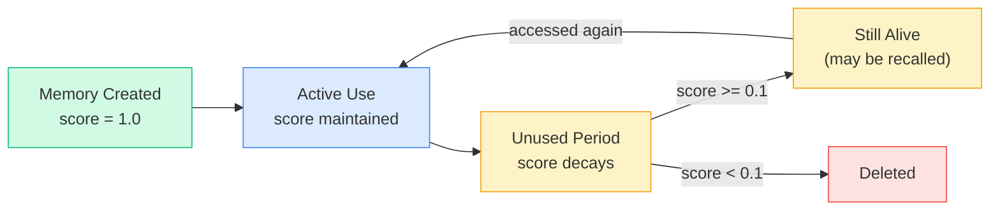
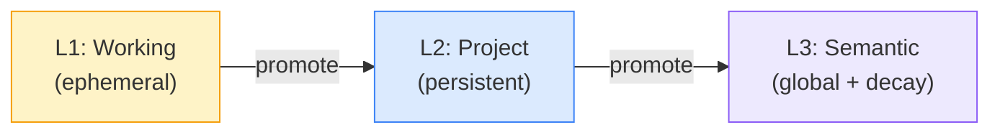

# Memory Types

Context Fabric organizes knowledge into six memory types across three storage layers. Memories route automatically -- you store content and the system figures out where it belongs.

## Table of Contents

- [Memory Types](#memory-types-1)
- [The Three Layers](#the-three-layers)
  - [L1: Working Memory](#l1-working-memory)
  - [L2: Project Memory](#l2-project-memory)
  - [L3: Semantic Memory](#l3-semantic-memory)
- [Smart Router](#smart-router)
- [Decay Algorithm](#decay-algorithm)
- [Promotion and Demotion](#promotion-and-demotion)

## Memory Types

Every memory has a `type` that describes what kind of knowledge it represents. The type influences which layer the Smart Router selects.

| Type | Default Layer | Use For |
|------|:---:|---------|
| `code_pattern` | L3 | Reusable code snippets, patterns, best practices |
| `bug_fix` | L2 | Resolved bugs with root cause and solution |
| `decision` | L2 | Architectural decisions and their rationale |
| `convention` | L3 | Code style, naming conventions, folder structure rules |
| `scratchpad` | L1 | Temporary notes, TODOs, session-scoped reminders |
| `relationship` | L3 | Domain relationships, entity connections, user preferences |

> [!TIP]
> You do not need to specify the layer when storing a memory. The Smart Router automatically selects the best layer based on the memory type, tags, and TTL. See [Smart Router](#smart-router) below.

## The Three Layers

Context Fabric uses a three-layer memory architecture. Each layer has different persistence, scope, and retrieval characteristics.



### L1: Working Memory

Ephemeral session-scoped context. Think of it as the AI's short-term memory.

| Property | Value |
|----------|-------|
| **Storage** | In-memory (Map) |
| **Scope** | Single session |
| **TTL** | Configurable (default: 1 hour) |
| **Eviction** | LRU when max size (1000) reached |
| **Persistence** | None — lost on server restart |
| **Search** | Linear scan |

**Typical contents:**
- Scratchpad notes and TODOs
- Current working file list
- Temporary thoughts and observations
- Session-specific reminders

### L2: Project Memory

Persistent project-specific knowledge. The main store for decisions, bug fixes, and project history.

| Property | Value |
|----------|-------|
| **Storage** | SQLite via `node:sqlite` (built-in, zero native deps) |
| **Scope** | Per-project |
| **TTL** | None — permanent until deleted or summarized |
| **Tables** | `memories`, `memory_tags`, `project_meta` |
| **Persistence** | File-based (survives restarts) |
| **Search** | Full-text via LIKE queries |

**Typical contents:**
- Architectural decisions and rationale
- Bug fixes with root cause analysis
- Code review feedback
- Project-specific documentation

The `project_meta` table stores per-project metadata including `last_seen` timestamps used by `context.orient` for offline-gap detection.

**Summarization:** Old memories (older than a configurable threshold) can be condensed into an archive entry via `context.summarize` to keep the database lean.

### L3: Semantic Memory

Long-term, cross-project knowledge with semantic vector search. This is the AI's long-term memory.

| Property | Value |
|----------|-------|
| **Storage** | SQLite via `node:sqlite` with embedding vectors stored as JSON arrays |
| **Scope** | Cross-project (global) |
| **TTL** | Decay-based (not time-based) |
| **Persistence** | File-based (survives restarts) |
| **Search** | In-process cosine similarity over embedding vectors |
| **Embedding Model** | `Xenova/all-MiniLM-L6-v2` (384 dimensions, ONNX) |

**Typical contents:**
- Reusable code patterns across projects
- Language and framework conventions
- Design patterns and best practices
- Domain knowledge and entity relationships

> [!NOTE]
> All vector operations run in-process — no external vector database required. Cosine similarity is computed in a linear scan over SQLite rows, which is fast for typical memory counts (under 10K).

## Smart Router

When you store a memory without specifying a layer, the Smart Router analyzes the content type, tags, and TTL to determine the optimal storage layer.



### Routing Rules

Rules are evaluated in priority order. The first match wins.

| Priority | Condition | Layer | Confidence |
|:--------:|-----------|:-----:|:----------:|
| 1 | `layer` parameter specified | As specified | 1.00 |
| 2 | Tags include `temp` | L1 | 0.95 |
| 2 | Tags include `global` | L3 | 0.95 |
| 2 | Tags include `project` | L2 | 0.95 |
| 3 | TTL specified | L1 | 0.90 |
| 4 | Type = `scratchpad` | L1 | 0.95 |
| 4 | Type = `code_pattern` | L3 | 0.90 |
| 4 | Type = `convention` | L3 | 0.90 |
| 4 | Type = `decision` | L2 | 0.85 |
| 4 | Type = `bug_fix` | L2 | 0.85 |
| 4 | Type = `relationship` | L3 | 0.85 |
| 5 | Default (no match) | L2 | 0.60 |

## Decay Algorithm

L3 memories use a decay algorithm instead of TTL. Unused memories gradually lose relevance and are eventually deleted. Frequently accessed memories resist decay.

### Formula

```text
score = (age_decay * 0.3 + inactivity_penalty * 0.7) + access_boost
```

Where:

| Component | Formula | Description |
|-----------|---------|-------------|
| `age_decay` | `exp(-age / (decayDays * 2))` | Older memories slowly fade |
| `inactivity_penalty` | `exp(-timeSinceAccess / decayDays)` | Unused memories fade faster |
| `access_boost` | `min(accessCount / 10, 0.5)` | Frequently used memories resist decay |

- `age` = time since creation (ms)
- `timeSinceAccess` = time since last access (ms)
- `decayDays` = configurable decay period (default: 30 days)
- `accessCount` = number of times the memory has been accessed

### Lifecycle



- **New memory**: Score starts near 1.0
- **Actively used**: Each access increments `accessCount`, boosting the score
- **Unused for 30+ days**: Score drops below 0.1 and the memory is deleted
- **10+ accesses**: The `access_boost` reaches its cap of 0.5, significantly resisting decay

Decay runs automatically every hour via `setInterval`.

> [!WARNING]
> Deleted memories cannot be recovered. If a memory is important, promote it or access it periodically to keep the score above the deletion threshold.

## Promotion and Demotion

Memories can be promoted to a higher layer using `context.promote`:

| From | To | What Happens |
|:----:|:--:|-------------|
| L1 | L2 | Memory is persisted to SQLite. Gains permanent storage and project scope. TTL is removed |
| L2 | L3 | Memory is embedded (vector generated) and stored globally. Gains semantic search and cross-project scope. Subject to decay |



There is no explicit demotion tool. L3 memories are naturally demoted (deleted) by the decay algorithm when they are no longer accessed. L1 memories expire via TTL. L2 memories persist indefinitely unless manually deleted or summarized.

---

[← Tools Reference](tools-reference.md) | [Architecture →](architecture.md) | [Back to README](../README.md)
