# Memory Types

Context Fabric organizes knowledge into **six memory types** across **three storage layers**. Memories route automatically — you store content and the system figures out where it belongs.

---

## Table of Contents

- [Quick Reference](#quick-reference)
- [Memory Types Table](#memory-types-table)
- [The Three Layers](#the-three-layers)
  - [L1: Working Memory](#l1-working-memory)
  - [L2: Project Memory](#l2-project-memory)
  - [L3: Semantic Memory](#l3-semantic-memory)
- [Smart Router](#smart-router)
  - [Decision Flow](#decision-flow)
  - [Routing Rules Priority](#routing-rules-priority)
- [Decay Algorithm](#decay-algorithm)
- [Promotion and Demotion](#promotion-and-demotion)
- [Summary](#summary)

---

## Quick Reference


---

## Memory Types Table

Every memory has a `type` that describes what kind of knowledge it represents. The type influences which layer the Smart Router selects.

| Type | Default Layer | Use Case |
|:-----|:-------------:|:---------|
| `code_pattern` | **L3** | Reusable code snippets, design patterns, algorithm implementations |
| `bug_fix` | **L2** | Resolved bugs with root cause analysis and solution |
| `decision` | **L2** | Architectural decisions and their rationale |
| `convention` | **L3** | Code style rules, naming conventions, folder structure preferences |
| `scratchpad` | **L1** | Temporary notes, TODOs, session-scoped reminders |
| `relationship` | **L3** | Domain relationships, entity connections, user preferences |

> [!TIP]
> You don't need to specify the layer when storing a memory. The [Smart Router](#smart-router) automatically selects the best layer based on the memory type, tags, and TTL.

---

## The Three Layers

```mermaid
flowchart TB
    subgraph L1["L1: Working Memory"]
        L1_STORE["Storage: In-memory Map RAM"]
        L1_SCOPE["Scope: Single session"]
        L1_TTL["TTL: 1 hour default"]
        L1_MAX["Max Size: 1000 entries LRU"]
        L1_PERSIST["Persistence: None"]
    end
    
    L1 -->|promote| L2
    
    subgraph L2["L2: Project Memory"]
        L2_STORE["Storage: SQLite node:sqlite"]
        L2_SCOPE["Scope: Per-project"]
        L2_TTL["TTL: None — permanent"]
        L2_SEARCH["Search: Full-text LIKE"]
    end
    
    L2 -->|promote| L3
    
    subgraph L3["L3: Semantic Memory"]
        L3_STORE["Storage: SQLite + 384-dim vectors"]
        L3_SCOPE["Scope: Cross-project global"]
        L3_DECAY["Lifecycle: Decay-based"]
        L3_SEARCH["Search: Cosine similarity"]
        L3_MODEL["Model: Xenova/all-MiniLM-L6-v2"]
    end
    
    style L1 fill:#e1f5fe
    style L2 fill:#e8f5e9
    style L3 fill:#fff3e0
```



### L1: Working Memory

Ephemeral session-scoped context. Think of it as the AI's short-term memory.

| Property | Value |
|:---------|:------|
| **Storage** | In-memory `Map<string, MemoryEntry>` |
| **Scope** | Single session |
| **Default TTL** | 3600 seconds (1 hour) |
| **Max Size** | 1000 entries |
| **Eviction Policy** | LRU (Least Recently Used) when max size reached |
| **Persistence** | None — lost on server restart |
| **Search** | Linear scan (O(n)) |

**Typical Contents:**
- Scratchpad notes and TODOs
- Current working file list
- Temporary thoughts and observations
- Session-specific reminders
- Transient CLI events (`file_opened`, `command_executed`)

**Storage Details:**
```typescript
interface WorkingMemoryEntry {
  memory: Memory;
  expiresAt: Date;  // TTL-based expiration
}
```

---

### L2: Project Memory

Persistent project-specific knowledge. The main store for decisions, bug fixes, and project history.

| Property | Value |
|:---------|:------|
| **Storage** | SQLite via `node:sqlite` (built-in, zero native deps) |
| **Scope** | Per-project (identified by `projectPath`) |
| **TTL** | None — permanent until deleted or summarized |
| **Persistence** | File-based (survives restarts) |
| **Search** | Full-text via `LIKE '%query%'` |

<details>
<summary>📋 Database Schema</summary>

```sql
CREATE TABLE memories (
  id TEXT PRIMARY KEY,
  type TEXT NOT NULL,
  content TEXT NOT NULL,
  metadata TEXT,          -- JSON blob
  tags TEXT,              -- JSON array
  created_at INTEGER NOT NULL,
  updated_at INTEGER NOT NULL,
  access_count INTEGER DEFAULT 0,
  last_accessed_at INTEGER
);

CREATE TABLE project_meta (
  key TEXT PRIMARY KEY,   -- e.g., 'last_seen'
  value TEXT NOT NULL
);
```

</details>

**Typical Contents:**
- Architectural decisions and rationale
- Bug fixes with root cause analysis
- Code review feedback
- Project-specific documentation
- Error records with solutions

**Summarization:**
Old memories (older than configurable threshold) can be condensed into an archive entry via `context.summarize()` to keep the database lean.

---

### L3: Semantic Memory

Long-term, cross-project knowledge with semantic vector search. This is the AI's long-term memory.

| Property | Value |
|:---------|:------|
| **Storage** | SQLite via `node:sqlite` with embedding vectors as JSON arrays |
| **Scope** | Cross-project (global to all projects) |
| **TTL** | Decay-based (not time-based) |
| **Persistence** | File-based (survives restarts) |
| **Search** | In-process cosine similarity |
| **Embedding Model** | `Xenova/all-MiniLM-L6-v2` (384 dimensions, ONNX) |
| **Default Decay** | 14 days |
| **Decay Threshold** | 0.2 (deleted below this score) |

<details>
<summary>📋 Database Schema</summary>

```sql
CREATE TABLE semantic_memories (
  id TEXT PRIMARY KEY,
  type TEXT NOT NULL,
  content TEXT NOT NULL,
  metadata TEXT NOT NULL,      -- JSON blob
  tags TEXT NOT NULL,          -- JSON array
  embedding TEXT NOT NULL,     -- JSON array [0.12, -0.34, ...]
  created_at INTEGER NOT NULL,
  updated_at INTEGER NOT NULL,
  accessed_at INTEGER NOT NULL,
  access_count INTEGER DEFAULT 0,
  relevance_score REAL DEFAULT 1.0,
  pinned INTEGER DEFAULT 0     -- exempt from decay
);
```

</details>

**Typical Contents:**
- Reusable code patterns across projects
- Language and framework conventions
- Design patterns and best practices
- Domain knowledge and entity relationships
- User preferences that span multiple projects

<details>
<summary>🔍 Vector Search Flow</summary>

```
Query: "auth error handling"
         ↓
    [Embedding Service]
         ↓
Query Vector: [0.12, -0.34, 0.56, ...] (384 dims)
         ↓
    [SQLite Scan]
         ↓
For each memory:
  - Load embedding from JSON
  - Compute cosine similarity
         ↓
Sort by similarity, return top N
```

</details>

> [!NOTE]
> All vector operations run in-process — no external vector database required. Cosine similarity is computed via linear scan over SQLite rows, which is fast for typical memory counts (under 10K).

---

## Smart Router

When you store a memory without specifying a layer, the Smart Router analyzes the content type, tags, and TTL to determine the optimal storage layer.

### Decision Flow


### Routing Rules Priority

Rules are evaluated in priority order. The first match wins.

| Priority | Condition | Layer | Confidence |
|:--------:|:----------|:-----:|:----------:|
| 1 | `layer` parameter specified | As specified | 1.00 |
| 2 | Tags include `temp` | L1 | 0.95 |
| 2 | Tags include `global` | L3 | 0.95 |
| 2 | Tags include `project` | L2 | 0.95 |
| 3 | TTL specified | L1 | 0.90 |
| 4 | Type = `scratchpad` | L1 | 0.95 |
| 4 | Type = `code_pattern` | L3 | 0.90 |
| 4 | Type = `convention` | L3 | 0.90 |
| 4 | Type = `decision` | L2 | 0.85 |
| 4 | Type = `bug_fix` | L2 | 0.85 |
| 4 | Type = `relationship` | L3 | 0.85 |
| 5 | Default (no match) | L2 | 0.60 |

---

## Decay Algorithm

L3 memories use a decay algorithm instead of TTL. Unused memories gradually lose relevance and are eventually deleted. Frequently accessed memories resist decay.

### Formula

```
relevance = (age_decay × 0.3 + inactivity_penalty × 0.7) + access_boost
```

Where:

| Component | Formula | Description |
|:----------|:--------|:------------|
| `age_decay` | `exp(-age / (decayDays × 2))` | Older memories slowly fade |
| `inactivity_penalty` | `exp(-timeSinceAccess / decayDays)` | Unused memories fade faster |
| `access_boost` | `min(accessCount / 10, 0.5)` | Frequently used memories resist decay |

**Variables:**
- `age` = time since creation (milliseconds)
- `timeSinceAccess` = time since last access (milliseconds)
- `decayDays` = configurable decay period (default: 14 days)
- `accessCount` = number of times the memory has been accessed

### Lifecycle


**Lifecycle Stages:**

| Stage | Score Range | State |
|:------|:------------|:------|
| **Fresh** | 1.0 | New memory, full relevance |
| **Active** | 0.8 - 1.0 | Recently accessed, stable |
| **Aging** | 0.4 - 0.8 | Decaying but recoverable |
| **At Risk** | 0.2 - 0.4 | Danger zone — access to save |
| **Deleted** | < 0.2 | Permanently removed |

**Key Behaviors:**

- **New memory**: Score starts at 1.0
- **Actively used**: Each access increments `accessCount`, boosting score by up to 0.5
- **10+ accesses**: Access boost caps at 0.5, significantly resisting decay
- **Unused for 14+ days**: Without access boost, score drops toward deletion threshold
- **Decay runs**: Automatically every hour via `setInterval`

> [!WARNING]
> Deleted memories cannot be recovered. If a memory is important, either:
> - Set `pinned: true` to exempt from decay
> - Access it periodically to maintain the access boost
> - Promote it from L2 (which doesn't decay)

---

## Promotion and Demotion

Memories can be promoted to a higher layer using `context.promote`:

### Promotion Paths

```mermaid
flowchart LR
    L1["L1: Working Memory<br/>• Ephemeral<br/>• Session scope<br/>• TTL expires"] 
    L2["L2: Project Memory<br/>• Persistent<br/>• Project scope<br/>• No decay<br/>• Full-text"]
    L3["L3: Semantic Memory<br/>• Global scope<br/>• Vector search<br/>• Decay applies<br/>• Semantic"]
    
    L1 -->|promote| L2
    L2 -->|promote| L3
    
    style L1 fill:#e1f5fe
    style L2 fill:#e8f5e9
    style L3 fill:#fff3e0
```



| From | To | What Happens |
|:----:|:--:|:-------------|
| **L1** | **L2** | Memory persisted to SQLite. Gains permanent storage and project scope. TTL is removed. |
| **L2** | **L3** | Memory is embedded (384-dim vector generated) and stored globally. Gains semantic search and cross-project scope. Subject to decay algorithm. |

### Promotion Example

```typescript
// Store in L1 (default for scratchpad)
const memory = await context.store({
  type: 'scratchpad',
  content: 'Idea: refactor auth middleware'
});

// Later, realize this is important — promote to L2
await context.promote({
  memoryId: memory.id,
  toLayer: 2
});

// Even later, recognize as reusable pattern — promote to L3
await context.promote({
  memoryId: memory.id,
  toLayer: 3
});
```

### Demotion

There is **no explicit demotion** tool. Layers naturally demote memories through their lifecycle mechanisms:

| Layer | Demotion Mechanism |
|:------|:-------------------|
| **L1** | TTL expiration or LRU eviction |
| **L2** | Manual deletion or summarization (archiving) |
| **L3** | Decay algorithm (automatic deletion when score < threshold) |

---

## Summary

```mermaid
flowchart TB
    subgraph Mapping["Memory Type → Layer Mapping"]
        L1["L1: Working<br/>Short-term"] --> T1["scratchpad<br/>Temporary notes, TODOs, session context"]
        L2["L2: Project<br/>Persistent"] --> T2["decision, bug_fix<br/>Project history, decisions, fixes"]
        L3["L3: Semantic<br/>Global + Decay"] --> T3["code_pattern, convention, relationship<br/>Reusable knowledge, patterns, preferences"]
    end
    
    style L1 fill:#e1f5fe
    style L2 fill:#e8f5e9
    style L3 fill:#fff3e0
```



**Key Takeaways:**

1. **Let the Smart Router decide** — don't specify layers unless you have a specific reason
2. **Tag memories** — use `temp`, `global`, or `project` tags to influence routing
3. **Pin important L3 memories** — set `pinned: true` to exempt from decay
4. **Use weights** — set `weight: 5` for critical memories to boost recall ranking
5. **Promote valuable L1 content** — don't let good ideas expire in working memory
